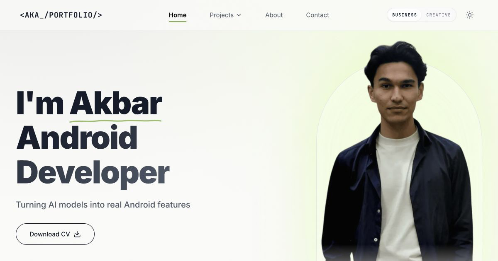
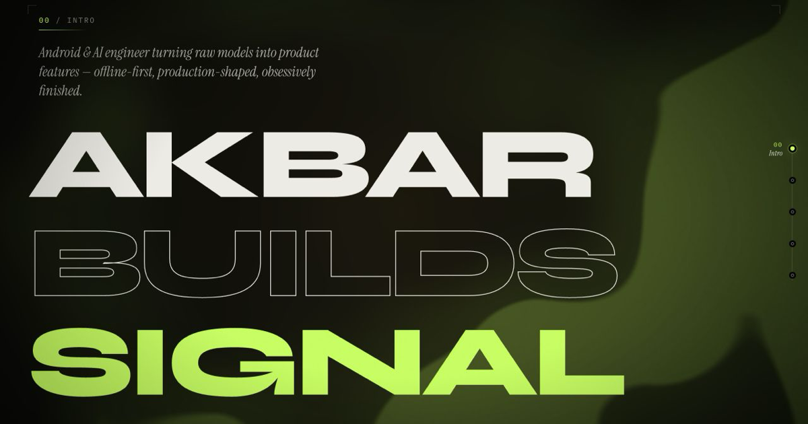

# Akbar Azizov — Android × AI

[](https://github.com/Akbar02Work/portfolio/actions/workflows/ci.yml)

<p align="center">
  <a href="https://www.akbar02work.xyz">
    
  </a>
  <a href="https://www.akbar02work.xyz/creative/">
    
  </a>
</p>

**One portfolio, two ways to read the same engineer.**

[Business](https://www.akbar02work.xyz) is the direct version: work, decisions, and
evidence. [Creative](https://www.akbar02work.xyz/creative/) is the expressive
version: motion, atmosphere, and personality. They are intentionally different
interfaces, but they ship from one repository and one release pipeline.
Creative is intentionally a desktop-only experience: below 901 px it shows an
access gate and keeps its desktop interactions out of the mobile runtime.

## Why two versions?

Most portfolios force engineering credibility and creative identity into the same
layout. This one keeps the tension visible.

| Business | Creative |
| --- | --- |
| Editorial and restrained | Kinetic and cinematic |
| Optimized for scanning | Designed for exploration |
| Project evidence first | Personality and atmosphere first |
| React app at the repository root | Independent React app in [`creative/`](creative/) |

The switch between them is part of the product idea—not a theme toggle. Each
version answers a different question: “Can this person build the work?” and “What
does it feel like to work with this person?”

## The engineering behind the presentation

This repository is more than a generated landing page. Its difficult parts live
at the seams:

- **Two applications, one deploy.** The Creative app is built independently,
  embedded at `/creative/`, and checked for output drift before CI can pass.
- **A case study, not a card grid.** Project data is modeled once and transformed
  into summaries, detail pages, metrics, galleries, and navigation without
  duplicating editorial content.
- **Motion with an exit path.** WebGL, scroll choreography, view transitions, and
  desktop interaction add character while reduced-motion behavior, keyboard
  navigation, semantic markup, and a conventional Business version keep the site
  usable.
- **Static hosting without static UX.** Client-side routes, direct project URLs,
  `/creative/`, `/old/`, metadata, and 404 behavior are prepared for a single
  Vercel deployment.
- **Privacy as a release constraint.** Public media is deliberately curated;
  project screenshots, the downloadable CV, claims, and external links are
  reviewed as publishable product data rather than copied into `public/`
  indiscriminately.
- **Quality gates that match the architecture.** Linting, cycle detection,
  TypeScript, unit tests, production builds, bundle budgets, Creative embed drift,
  and Playwright browser tests run as one CI contract.

The featured cases are:

- [Lumingo](https://www.akbar02work.xyz/projects/lumingo), a language-learning
  product presented across Android, Web, and an openly in-development iOS client.
- [VoiceNotes](https://www.akbar02work.xyz/projects/voicenotes), a native Android
  voice-to-notes system that turns short recordings into searchable notes through
  cloud providers or a verified on-device Russian transcription path.

## Human direction, AI-assisted execution

AI tools were used as accelerators for exploration, implementation passes,
debugging, review, and documentation. They did not choose the product direction
or publish the result.

I remained responsible for the architecture, visual direction, project claims,
source selection, privacy review, trade-offs, and final release acceptance.
That boundary matters here: generated output is input to an engineering process,
not evidence of completion.

## Repository map

```text
src/                 Business portfolio and case-study system
creative/            Creative portfolio application
public/creative/     Generated Creative embed shipped by the root app
scripts/             Build integration, route, image, cycle, and bundle checks
tests/               Browser-level release checks
docs/history/        Archived design and audit context
```

For a local review, use Node.js 24:

```bash
npm install
npm --prefix creative install
npm run dev:pair
```

`npm run ci` runs the fast production gates for both applications.
`npm run ci:full` adds Playwright.

## License

The source code is available under the MIT License. The portfolio's visual
identity, written content, personal brand, CV, photographs, and project media are
not licensed for reuse. See [LICENSE](LICENSE) for the exact boundary.
