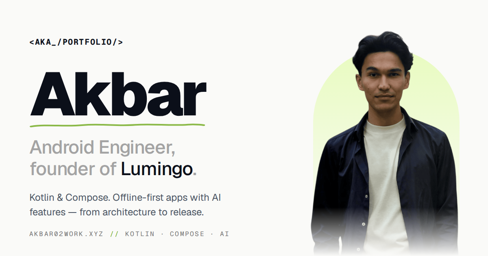
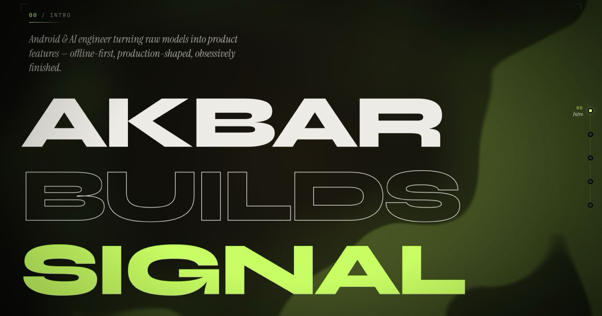

# Akbar Azizov — Android × AI

[](https://github.com/Akbar02Work/portfolio/actions/workflows/ci.yml)

<p align="center">
  <a href="https://www.akbar02work.xyz">
    
  </a>
  <a href="https://www.akbar02work.xyz/creative/">
    
  </a>
</p>

One portfolio, two interfaces: [Business](https://www.akbar02work.xyz) presents
projects and engineering decisions; [Creative](https://www.akbar02work.xyz/creative/)
presents motion, atmosphere and personality. Both ship from one repository.
Business supports English and [Russian](https://www.akbar02work.xyz/ru). Creative's
desktop content is English; below 901 px it shows a Russian gate and a Business link.

The public case is **AI Voice Notes** (`voicenotes`). **Lumingo is in development
and unpublished** (`published: false`); its DEV-only preview uses `?preview=1`.
The catalog controls public routes, cards, navigation, sitemap and Creative
visibility. Both EN/RU CV files are available; their links to the hidden Lumingo
case are intentionally retained by the owner.

## Repository map

| Location | Purpose |
| --- | --- |
| `src/` | Business: React 18, TypeScript, Tailwind, React Router |
| `src/data/`, `src/i18n/` | Project content, publication, EN/RU copy and locale routes |
| `creative/` | Independent React 19 app with GSAP, Lenis and WebGL |
| `public/creative/` | Generated Creative embed included in the root build |
| `public/old/` | Intentional public archive, excluded from indexing |
| `scripts/`, `tests/e2e/` | Build integration, static release checks and profiling |
| [docs/HANDOFF.md](docs/HANDOFF.md) | Current context, owner decisions and code map |
| [Lumingo contract](docs/specs/2026-08-07-lumingo-portfolio-design.md) | Platform behavior and future publication |
| [Performance notes](docs/audits/2026-09-05-performance-optimization.md) | Lab usage and historical measurements |

## Local development

Use Node.js 24 and npm, matching [CI](.github/workflows/ci.yml). Install each app
from its lockfile:

```bash
npm ci
npm --prefix creative ci
npm run dev:pair
```

The pair supervisor runs Business at `http://127.0.0.1:5173/` and Creative at
`https://127.0.0.1:5174/` (local HTTPS). It uses POSIX process groups and is intended
for Linux/macOS. Occupied ports cause startup to fail without stopping their owner.
`npm run dev:pair:stop` stops only this checkout's supervisor and children.

For Business alone use `npm run dev`; for Creative alone use
`npm --prefix creative run dev`. Three quick logo clicks on the Business home
page open a chooser for Creative and Old. Creative's Business link returns to
the main site.

## Build and embed

| Command | Behavior |
| --- | --- |
| `npm run build` | Builds Business and copies the saved `public/creative/` embed into `dist/` |
| `npm run build:creative` | Builds Creative with `/creative/` base and replaces `public/creative/` |
| `npm run build:all` | Refreshes Creative, then builds Business |
| `npm run check:creative-drift` | Rebuilds Creative and compares the embed byte for byte without updating it |
| `npm run preview` | Standard Vite preview; does not validate production 404/header behavior |

After Creative source or catalog publication changes, refresh the embed on
Linux/macOS and include its output with the change. Windows output hashes may
differ: use the ordinary Business build with the saved embed there. The embed
script can install Creative dependencies if they are missing; install them
explicitly first when preparing a reproducible build.

Business builds route-specific EN/RU metadata and `dist/sitemap.xml` from the
public catalog. This is metadata prerendering, not full React SSR. Unknown and
hidden routes return static 404s; the error page selects EN/RU from its URL and
uses the saved theme. Localization of the static fallback requires JavaScript.

## Checks

Choose focused checks for the files changed. Existing commands include `npm test`,
`npm run typecheck`, `npm run lint:all`, and `npm run test:scripts`.

For a release:

```bash
npx playwright install chromium
npm run ci:full
```

`npm run ci` checks both apps: Creative lint/build/drift/budget, Business lint,
cycles, TypeScript, unit tests, script tests, build and budget. `ci:full` adds
Chromium E2E. Gzip limits are 150 KiB for Business initial JS/CSS and 150 KiB for
all Creative JS/CSS. Test counts and current sizes come from command output.

`npm run test:e2e` builds **Business with the saved Creative embed**, then runs
Playwright. Its server reads `vercel.json` through `scripts/serve-static.mjs` and
checks real 404 responses locally. It is a bounded server, not a Vercel emulator.
For other engines, install them with `npx playwright install firefox webkit`, then
run `npx playwright test --browser=firefox` or `--browser=webkit` after a build.

## Configuration and release

| Variable | Use |
| --- | --- |
| `VITE_SENTRY_DSN` | Optional Business error monitoring, enabled only in production |
| `VITE_SOURCEMAP=true` | Enables production source maps; CI sets it for verification |
| `VITE_BASE_URL` | Vite base path; root defaults to `/`, embedded Creative uses `/creative/` |
| `VITE_CREATIVE_URL` / `VITE_BUSINESS_URL` | Overrides cross-app destinations in Business / Creative |
| `VITE_DEV_HOST` / `VITE_DEV_PORT` | Business dev host/port; default port is 5173 |
| `ANALYZE=true` | Bundle visualization via `npm run analyze` |

`VITE_*` values are build-time client configuration, not a place for private keys.
Business includes Vercel Speed Insights; actual telemetry configuration is checked
on the deployment. Production cross-app links default to the current origin.

Hosting is configured for Vercel with `dist/` output and `vercel.json` routing,
CSP and cache rules. Fonts, portraits, project images and mockups cache for one day;
hashed JS/CSS cache for one year, immutable. HTML has no long-lived override.
Rename unversioned assets when an immediate refresh is needed.

Before publishing, run release checks and verify the candidate deployment:
EN/RU direct routes and reload, 404, CV, contacts, gallery, language/theme,
Business–Creative transitions, metadata and asset loading. Confirm the deployment
branch and previous-deployment rollback in Vercel rather than relying on an old
handoff. Publishing is a separate owner-authorized action.

## Images and performance

`npm run optimize:images` creates raster derivatives; `-- --phone-frame` rebuilds
only the phone bezel variant. These commands write public assets. Route preloads
share responsive portrait sizes with React and select existing project covers.
Profiling commands and measurement limits are in the
[performance notes](docs/audits/2026-09-05-performance-optimization.md).

## Ownership and license

AI tools assisted implementation, review and documentation. Product direction,
project claims and release acceptance remain the owner's responsibility.
The implementation code uses MIT; visual identity, written content, CV, photos
and project media are excluded from reuse. See [LICENSE](LICENSE).
